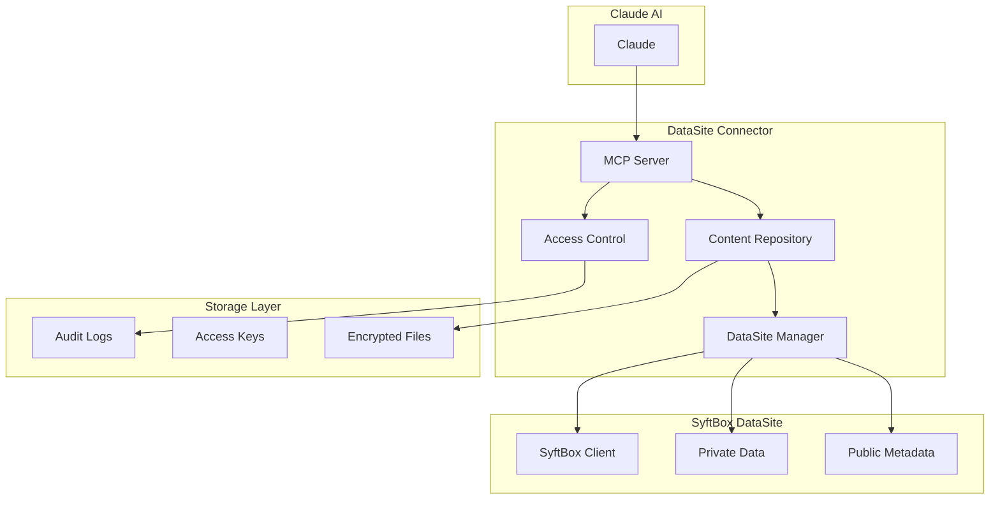

# DataSite Connector Architecture

## Overview

DataSite Connector is a privacy-preserving data sharing platform built on OpenMined SyftBox that enables secure access to proprietary content through Claude MCP (Model Context Protocol) connectors.

## System Architecture

### High-Level Architecture



## Core Components

### 1. DataSite Manager (`datasite_manager.py`)

**Purpose**: Integration layer with SyftBox for datasite operations.

**Key Responsibilities**:
- Initialize and configure SyftBox datasite
- Manage dataset metadata and discovery
- Handle content ingestion from various sources
- Maintain datasite directory structure
- Perform periodic maintenance and cleanup

**Key Classes**:
- `DataSiteManager`: Main management class
- `DatasetMetadata`: Dataset metadata structure

**Design Patterns**:
- Repository pattern for dataset storage
- Observer pattern for file system monitoring
- Factory pattern for metadata creation

### 2. Content Repository (`content_repository.py`)

**Purpose**: Encrypted storage and management of proprietary content.

**Key Responsibilities**:
- End-to-end encryption of all content
- Content integrity verification
- Search indexing and content discovery
- Privacy-preserving content summaries
- Access statistics and usage tracking

**Key Classes**:
- `ContentRepository`: Main repository class
- `ContentItem`: Individual content representation

**Security Features**:
- AES encryption using Fernet
- SHA-256 content hashing for integrity
- Secure key management with file permissions
- Content access auditing

### 3. MCP Server (`mcp_server.py`)

**Purpose**: Claude Model Context Protocol server implementation.

**Key Responsibilities**:
- Expose content through standardized MCP tools
- Handle authentication and authorization
- Apply privacy-preserving techniques
- Rate limiting and request validation
- Error handling and logging

**MCP Tools Provided**:
- `list_datasets`: Discover available datasets
- `get_content`: Retrieve specific content
- `search_content`: Search across content
- `get_content_summary`: Privacy-preserving summaries

**Design Patterns**:
- Command pattern for tool execution
- Chain of responsibility for request processing
- Decorator pattern for privacy application

### 4. Access Control System (`access_control.py`)

**Purpose**: Authentication, authorization, and audit management.

**Key Responsibilities**:
- JWT-based token authentication
- Granular permission management
- Rate limiting and abuse prevention
- Comprehensive audit logging
- Policy-based access control

**Key Classes**:
- `AccessControlSystem`: Main access control class
- `AccessToken`: Token representation
- `AccessPolicy`: Policy definition
- `AccessAuditLog`: Audit log entries

**Security Features**:
- JWT with HMAC-SHA256 signing
- Bcrypt password hashing
- Token expiration and revocation
- Request rate limiting
- Comprehensive audit trails

## Data Flow

### Content Ingestion Flow

1. **Content Upload**:
   ```
   User Content → DataSite Manager → Validation → Content Repository
   ```

2. **Encryption Process**:
   ```
   Raw Content → Fernet Encryption → Hash Generation → Secure Storage
   ```

3. **Metadata Creation**:
   ```
   Content Info → DatasetMetadata → Public Discovery → Search Index
   ```

### Content Access Flow

1. **Authentication**:
   ```
   Claude Request → JWT Validation → Token Verification → Access Control
   ```

2. **Authorization**:
   ```
   Access Request → Policy Check → Permission Validation → Rate Limiting
   ```

3. **Content Retrieval**:
   ```
   Authorized Request → Content Decryption → Privacy Application → Response
   ```

## Privacy Architecture

### Data Sovereignty

- **Local Control**: All data remains on user's system
- **No Data Movement**: Computations happen locally
- **Explicit Consent**: All access requires explicit approval
- **Revocable Access**: Permissions can be revoked instantly

### Encryption Strategy

```
Plaintext Content → Fernet(AES-128) → Base64 Encoding → Storage
                 ↑
         Derived from 256-bit key
```

### Differential Privacy Implementation

- **Noise Addition**: Calibrated noise based on epsilon parameter
- **Statistical Summaries**: Privacy-preserving statistics
- **Query Budgeting**: Track privacy budget consumption
- **Composition Guarantees**: Formal privacy guarantees

## Security Model

### Threat Model

**Protected Against**:
- Unauthorized content access
- Data exfiltration attacks
- Token replay attacks
- Brute force authentication
- Content tampering
- Metadata inference attacks

**Trust Assumptions**:
- Local system security
- SyftBox platform security
- Claude MCP client behavior
- Network transport security (HTTPS)

### Security Layers

1. **Transport Security**: HTTPS/TLS for all communications
2. **Authentication**: JWT-based token system
3. **Authorization**: Role-based access control
4. **Encryption**: End-to-end content encryption
5. **Integrity**: Content hash verification
6. **Auditing**: Comprehensive access logging

## Performance Considerations

### Scalability

- **Content Storage**: Designed for thousands of datasets
- **Concurrent Access**: Async/await for high concurrency
- **Memory Usage**: Streaming for large content items
- **Search Performance**: Indexed search with caching

### Optimization Strategies

- **Lazy Loading**: Content loaded on-demand
- **Caching**: Metadata and search results caching
- **Compression**: Optional content compression
- **Batch Operations**: Efficient bulk operations

## Configuration Management

### Configuration Hierarchy

1. **Environment Variables**: Runtime overrides
2. **Configuration File**: YAML-based settings
3. **Default Values**: Built-in defaults
4. **Runtime Parameters**: Dynamic configuration

### Key Configuration Areas

- **SyftBox Integration**: Datasite paths and settings
- **Content Storage**: Encryption and storage paths
- **MCP Server**: Network and protocol settings
- **Access Control**: Security and rate limiting
- **Privacy**: Differential privacy parameters
- **Logging**: Debug and audit configuration

## Error Handling Strategy

### Error Categories

1. **System Errors**: Infrastructure failures
2. **Security Errors**: Authentication/authorization failures
3. **Data Errors**: Content corruption or validation failures
4. **Network Errors**: Communication failures
5. **Configuration Errors**: Setup and configuration issues

### Recovery Mechanisms

- **Graceful Degradation**: Continue operating with limited functionality
- **Automatic Retry**: Retry transient failures with backoff
- **Circuit Breaker**: Prevent cascade failures
- **Fallback Responses**: Provide meaningful error responses
- **State Recovery**: Recover from partial failures

## Testing Strategy

### Test Pyramid

1. **Unit Tests**: Individual component testing
2. **Integration Tests**: Component interaction testing
3. **End-to-End Tests**: Full system workflow testing
4. **Security Tests**: Penetration and vulnerability testing
5. **Performance Tests**: Load and stress testing

### Test Coverage Areas

- **Encryption/Decryption**: Cryptographic operations
- **Access Control**: Authentication and authorization
- **Content Management**: Storage and retrieval
- **MCP Protocol**: Claude integration
- **Error Handling**: Failure scenarios
- **Privacy Features**: Differential privacy implementation

## Deployment Architecture

### Local Deployment

```
User System:
│
├── DataSite Connector App
│   ├── MCP Server (localhost:8080)
│   ├── Content Repository
│   └── Access Control
│
├── SyftBox DataSite
│   ├── Private Data
│   └── Public Metadata
│
└── Claude MCP Client
    └── Connects to localhost:8080
```

### Production Considerations

- **SSL/TLS**: HTTPS with proper certificates
- **Firewall**: Network access controls
- **Monitoring**: Health checks and metrics
- **Backup**: Encrypted key and data backup
- **Updates**: Secure update mechanisms

## Future Enhancements

### Planned Features

1. **Web UI**: Browser-based management interface
2. **Multi-User**: Support for multiple user accounts
3. **Federation**: Cross-datasite collaboration
4. **Advanced Analytics**: ML-powered content analysis
5. **Mobile Support**: Mobile app integration
6. **API Gateway**: RESTful API for external integration

### Scalability Roadmap

1. **Distributed Storage**: Support for distributed content storage
2. **Load Balancing**: Multiple MCP server instances
3. **Database Backend**: Persistent metadata storage
4. **Microservices**: Decompose into smaller services
5. **Container Support**: Docker and Kubernetes deployment